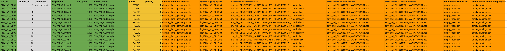

# ilandc-runner
A simple python tool for iLand that helps you run multiple ilandc simulation runs on a linux server and run them in parallel.
You only need to configure some excel files, then run the scripts and wait.

# Installation
- make sure to run `python -m pip install -r requirements.txt` (or use whatever python package manager you want) to install the python requirements.
- for multithreading you shoud have `screen` installed. should come preinstalled on linux servers but do `which screen` to confirm

# Usage

## Preparing iLand projects

### Excel csv tables
- create one or more iLand projects
- in the root folder of the iLand project, you can place a .xlsx or .csv file, where each line defines one run
- the table has the following format:
    - green columns are compulsory for each run, otherwise the script will fail
    - yellow columns are optional, however they have to follow the syntax of the iland project file, e.g. project.system.database.climate
 (see [wiki](https://iland-model.org/project+file?highlight=project+file) for reference)

- excel files can have multiple tables, they are all loaded automatically
- you can place multiple files in the project root; as long as they end on .xlsx or .csv, they are loaded (if you don't want them to run, you need to place them in a subfolder)

### run settings
- copy the file `settings.toml.template` to `settings.toml`
- take a look at the toml file and change the settings according to their explanations
    - the path to the ilandc executable needs to be defined; this is different for every system
    - you can list multiple iLand projects folders (where your excel tables are placed)
    - you can change the settings, if you want to have multiple workers working in parallel

## Running the simulations
1. make sure you prepared all the files as described in section "Preparing iLand projects"
2. run `python 01_prepare_queue.py` and check the created *ilandc_commands.sh* if all the correct ilandc commands are listed there
    - the script will automatically check if you have already done a simulation (by checking if the output sqlite is already there) and will skip it. if you want to redo it, you need to delete or move the sqlite
    - you can sanity check the produced `instruction_queues/all-commands.sh`. Check if all the runs are there as you specified them with the excel files.
3. run `python 02_prepare_workers.py`
    - this will create a seperate script for each worker in folder `instruction_queues`
    - beware that you should limit the threads per worker in the `settings.toml` if you use multiple workers to not overload your server
4. run `python 03_start_workers.py`
    - this will run the previously created worker scripts each in a seperate screen session; screen makes sure that scripts keep running even if you close your ssh session; you can take a look at the active screen session with `screen -ls`, then attach to a session using `screen -r SESSION_ID` and detach by pressing Ctrl+A+D (more info on screen [here](https://gist.github.com/jctosta/af918e1618682638aa82))
    - while the script is running, the workers will add the commands to either `status/successful-commands.txt` or `status/failed-commands.txt`, depending on if they ran without errors or not
    - if you have commands in the failed commands either check the log files or run the command individually without the ilandc runner to check what's wrong
5. do a final check and see if all output sqlites where produced correctly; you can also run `python 01_prepare_queue.py` and if all results were produced correctly it should skip all of the runs

# Troubleshooting
- if you have any problems with the ilandc-runner that you can't fix, write a message on the iLand Discord or write to me (jonas.kerber@tum.de) directly
- feedback on how to improve the ilandc-runner is also welcome

-----

**Happy simulating!**
